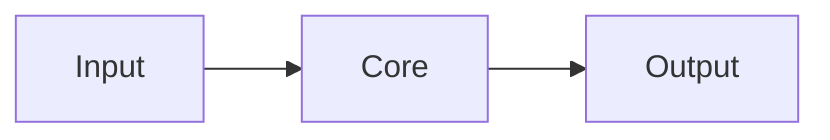
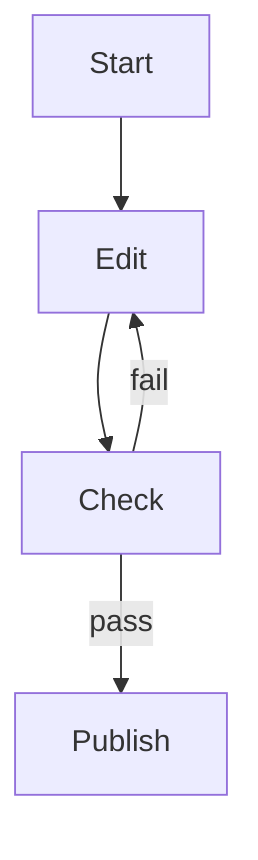

# {{PROJECT_NAME}}

> **{{ONE_LINE_SUMMARY}}**

[](#status)
[](#license)
[](https://github.com/{{OWNER}}/nezu-md)

| | |
| --- | --- |
| **What** | {{WHAT}} |
| **Who** | {{WHO}} |
| **Why** | {{WHY}} |

---

## Summary

{{SUMMARY_PARAGRAPH}}

| Aspect | Detail |
| --- | --- |
| Problem | {{PROBLEM}} |
| Approach | {{APPROACH}} |
| Outcome | {{OUTCOME}} |

---

## Key Features

| Feature | Description | Benefit |
| --- | --- | --- |
| {{FEATURE_1}} | {{FEATURE_1_DESC}} | {{FEATURE_1_BENEFIT}} |
| {{FEATURE_2}} | {{FEATURE_2_DESC}} | {{FEATURE_2_BENEFIT}} |
| {{FEATURE_3}} | {{FEATURE_3_DESC}} | {{FEATURE_3_BENEFIT}} |

---

## Screenshots

> 画像が用意でき次第、ここに配置する。

| View | Description |
| --- | --- |
| Overview | {{SCREENSHOT_OVERVIEW}} |
| Detail | {{SCREENSHOT_DETAIL}} |

```text
[ screenshot: overview ]
[ screenshot: detail ]
```

---

## Quick Start

最短で動かす手順。

### Prerequisites

- {{PREREQ_1}}
- {{PREREQ_2}}

### Steps

```bash
{{QUICKSTART_COMMANDS}}
```

### Verify

```bash
{{VERIFY_COMMAND}}
```

成功時の目安: {{SUCCESS_CRITERIA}}

---

## Installation

```bash
{{INSTALL_COMMANDS}}
```

| Method | Command | When to use |
| --- | --- | --- |
| {{METHOD_1}} | `{{METHOD_1_CMD}}` | {{METHOD_1_WHEN}} |
| {{METHOD_2}} | `{{METHOD_2_CMD}}` | {{METHOD_2_WHEN}} |

---

## Configuration

| Key | Type | Default | Description |
| --- | --- | --- | --- |
| `{{CONFIG_KEY}}` | {{TYPE}} | `{{DEFAULT}}` | {{CONFIG_DESC}} |

```yaml
# example config
{{CONFIG_EXAMPLE}}
```

---

## Architecture



| Component | Responsibility |
| --- | --- |
| {{COMPONENT_1}} | {{COMPONENT_1_ROLE}} |
| {{COMPONENT_2}} | {{COMPONENT_2_ROLE}} |

---

## Directory Structure

```text
{{PROJECT_NAME}}/
├── README.md
├── docs/
├── src/
└── ...
```

| Path | Role |
| --- | --- |
| `docs/` | 仕様とガイド |
| `src/` | 実装 |

---

## Workflow



1. {{STEP_1}}
2. {{STEP_2}}
3. {{STEP_3}}

---

## FAQ

| Question | Answer |
| --- | --- |
| {{Q1}} | {{A1}} |
| {{Q2}} | {{A2}} |
| {{Q3}} | {{A3}} |

---

## Roadmap

| Status | Item | Notes |
| --- | --- | --- |
| Done | {{DONE_ITEM}} | {{DONE_NOTE}} |
| Now | {{NOW_ITEM}} | {{NOW_NOTE}} |
| Next | {{NEXT_ITEM}} | {{NEXT_NOTE}} |
| Later | {{LATER_ITEM}} | {{LATER_NOTE}} |

---

## Status

| Field | Value |
| --- | --- |
| Version | {{VERSION}} |
| Maturity | {{MATURITY}} |
| Maintained | {{MAINTAINED}} |

---

## Contributing

貢献手順は [`CONTRIBUTING.md`](../CONTRIBUTING.md) を参照する。

1. Issue で意図を共有する
2. ブランチを切る
3. nezu-md チェックリストを通す
4. PR を出す

---

## License

{{LICENSE}} — 詳細は [`LICENSE`](../LICENSE) を参照する。
