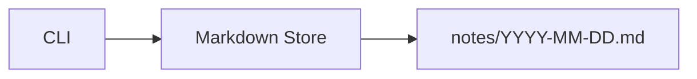

# Sample App

> **短い例**: nezu-md の最小構成で書いた架空アプリの README。

[](#status)
[](#license)
[](../README.md)

| | |
| --- | --- |
| **What** | ローカルメモを Markdown で管理する CLI |
| **Who** | 個人開発者と小さなチーム |
| **Why** | メモの置き場と書式を固定し、検索可能にする |

---

## Summary

Sample App は、日々のメモを 1 リポジトリに集約するための最小 CLI である。

| Aspect | Detail |
| --- | --- |
| Problem | メモが散らばり、後から探せない |
| Approach | 日付ベースの Markdown ファイルと単純な検索コマンド |
| Outcome | 追加・一覧・検索が数秒で終わる |

---

## Key Features

| Feature | Description | Benefit |
| --- | --- | --- |
| `add` | 今日のメモを追記する | 迷わず記録できる |
| `list` | 直近のメモを一覧する | 振り返りが速い |
| `search` | キーワードで絞り込む | 過去の決定を取り戻せる |

---

## Quick Start

### Prerequisites

- Node.js 20+

### Steps

```bash
npm install -g sample-app
sample-app add "リリース手順を確認した"
sample-app list
```

### Verify

```bash
sample-app search リリース
```

成功時の目安: 追記したメモが一覧または検索結果に表示される。

---

## Architecture



| Component | Responsibility |
| --- | --- |
| CLI | コマンド受付と出力 |
| Markdown Store | ファイルの読み書き |
| notes/ | 実体の保存先 |

---

## Directory Structure

```text
sample-app/
├── README.md
├── bin/
│   └── sample-app.js
├── lib/
│   ├── store.js
│   └── search.js
└── notes/
```

---

## FAQ

| Question | Answer |
| --- | --- |
| クラウド同期はありますか | ありません。Git 管理を前提にします |
| エディタ連携はありますか | ありません。標準の Markdown 編集で足ります |
| Windows で動きますか | Node.js が入っていれば動きます |

---

## Roadmap

| Status | Item | Notes |
| --- | --- | --- |
| Done | add / list / search | 最小機能 |
| Next | tags | フロントマターで付与 |
| Later | TUI | 対話的な一覧 |

---

## Status

| Field | Value |
| --- | --- |
| Version | 0.1.0 |
| Maturity | Example only |
| Maintained | No (sample) |

---

## License

MIT
