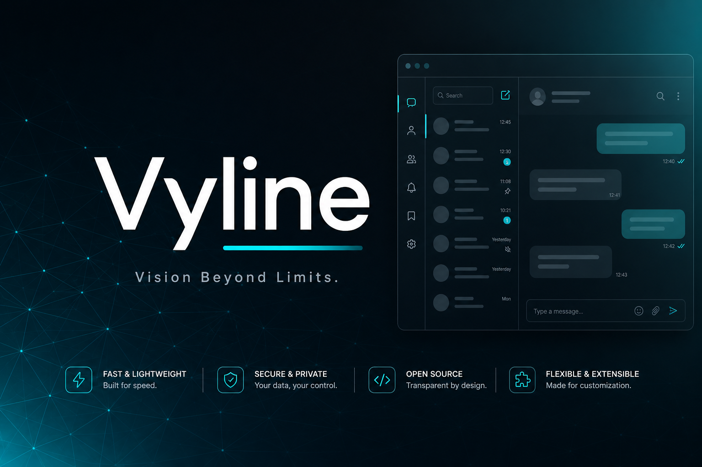

<p align="center">
  
</p>

<h1 align="center">Vyline</h1>

<p align="center">
  <strong>Vision Beyond Limits.</strong><br/>
  自前プロトコルで動く、LINE サードパーティクライアント（Web / React）
</p>

<p align="center">
  
  
  
  
  
  
</p>

> ⚠️ **Beta 版です。** LINE 非公式のサードパーティクライアントで、利用はすべて自己責任です。
> アカウント停止のリスクがあるため、**メインアカウントでの利用は推奨しません**。

---

## What is Vyline?

**Vyline** は LINE にログインしてメッセージの送受信・Flex/Rich 表示・テーマカスタマイズを行うサードパーティクライアントです。

外部 `@evex/linejs` に依存せず、**自前の LINE プロトコルスタック `@vyline/nezuline`（NezuLINE）** で動作します。公式クライアントの解析成果を活用し、E2EE（Letter Sealing）の復号・送信まで対応しています。

| | |
|---|---|
| **誰向け** | LINE の UI を自分好みにしたい人・開発者 |
| **なにが違う** | 公式にない体験: NezuTheme / 密度制御 / メンション / LINE 絵文字 / ローカル最適化 |
| **ライセンス** | MIT |
| **状態** | Beta（開発中） |

---

## Key Features

- **ログイン** — QR / Email ログイン、マルチアカウント、セッション復元
- **メッセージ** — 送受信 / 返信 / 取り消し / 既読制御 / 再送
- **メンション** — `@ALL` / `@名前`（LINE Desktop 準拠の `MENTION` metadata）
- **LINE 絵文字（sticon）** — 文中挿入・送受信描画
- **メディア** — 画像・動画・音声送受信（画像はクライアント側で自動圧縮）
- **スタンプ** — 所持パック / プレミアム / アニメーション / くっつき
- **Flex / Rich** — 公式準拠の描画、カルーセルのマウスドラッグ
- **リアクション** — 1 クリック、公式バッジ、既読者一覧
- **チャット管理** — ピン / 非表示 / ミュート / ブロック / MID コピー / グループ作成・招待
- **NezuTheme** — フルカスタマイズテーマ、文字サイズ、密度、プロフィール背景
- **プライバシー** — ストリーマーモード、PIN ロック
- **その他** — トーク保存（TXT エクスポート）/ 設定の初期化 / 更新チェック

---

## Version

バージョンは `store.ts` / `package.json` / `README.md` の 3 箇所を同一に揃えます。リリース時は `docs/distribution.md` のチェックリストを参照。beta は非公開テスト段階です。

---

## Quick Start

```bash
bun install
bun run dev          # backend :3001 + frontend :5173
```

ブラウザで `http://localhost:5173` を開きます。

| コマンド | 内容 |
|---|---|
| `bun run dev:backend` | backend のみ（:3001） |
| `bun run dev:frontend` | frontend のみ（:5173） |
| `bun run typecheck` | 型チェック（全ワークスペース） |
| `bun run lint` | Biome lint |
| `bun run build` | frontend 本番ビルド |

詳細: [docs/onboarding.md](docs/onboarding.md) · [docs/development.md](docs/development.md) · [AGENTS.md](AGENTS.md)

---

## Architecture

```
┌─ Frontend (React + Vite) ── apps/desktop ──┐
│  store / mappers / sync / NezuTheme UI     │
├─ Backend (Hono on Bun) ───── backend ─────┤
│  BFF routes → lineService → clientManager  │
├─ NezuLINE ──────────── packages/nezuline ──┤
│  domain / dictionary / E2EE / Thrift stack │
└─ LINE Servers ────────────────────────────┘
```

| パス | 役割 |
|---|---|
| `Vyline/apps/desktop` | React UI |
| `Vyline/backend` | Hono BFF |
| `Vyline/packages/nezuline` | プロトコル本体（NezuLINE） |
| `Vyline/packages/line-types` | Thrift 型（vendored） |

---

## 🔎 vyline-search（解析ツールキット）

Vyline の LINE 逆解析基盤は独立リポジトリとして公開しています:

**[github.com/nezumi0627/vyline-search](https://github.com/nezumi0627/vyline-search)**

Desktop LINE（Themida 保護）の **unpack / ネイティブシンボル検索 / 逆コンパイル** を行うツールキットです。教育・研究目的で、`findNativeSymbol` による文字列 xref 解析と Ghidra decompile をワンコマンドで実行できます。

---

## E2EE / Desktop 鍵

過去メッセージの復号には、公式 LINE Desktop から抽出した**自己鍵一式**が必要です。

1. LINE.exe 起動状態で鍵を抽出（[docs/analysis/](docs/analysis/)）
2. `Vyline/backend/data/desktop-e2ee-keys.json` に配置（**gitignore・コミット禁止**）
3. backend 起動時に自動 import

---

## Contributing

Issue / PR テンプレートは `.github/` に用意しています。

- 🐛 [Bug report](.github/ISSUE_TEMPLATE/bug_report.md)
- ✨ [Feature request](.github/ISSUE_TEMPLATE/feature_request.md)
- 📝 [Pull request](.github/pull_request_template.md)

貢献フロー: [docs/CONTRIBUTING.md](docs/CONTRIBUTING.md)

**注意:** このプロジェクトは LINE の規約・利用条件に抵触する可能性があります。PR には解析対象ソフトウェアの実体・鍵・トークンなどを含めないでください。

---

## Docs

| リンク | 内容 |
|---|---|
| [docs/README.md](docs/README.md) | ドキュメント索引 |
| [docs/onboarding.md](docs/onboarding.md) | 初日チェックリスト |
| [docs/CONTRIBUTING.md](docs/CONTRIBUTING.md) | 貢献フロー |
| [docs/architecture.md](docs/architecture.md) | 層構造 |
| [docs/development.md](docs/development.md) | 開発コマンド |
| [docs/protocol/dictionary.md](docs/protocol/dictionary.md) | RPC 辞書 |
| [AGENTS.md](AGENTS.md) | エージェント向けガイド |
| [CHANGELOG.md](CHANGELOG.md) | 変更履歴 |

---

## Legal / Disclaimer

本ソフトウェアは **LINE の公式製品ではありません**。LINE の利用規約に違反する可能性があり、利用によりアカウント停止等のリスクがあります。本ソフトウェア利用による一切の問題について、開発者は責任を負いません。

- 教育・学習・個人利用の範囲でご利用ください
- 第三者への迷惑行為・不正利用は禁止です
- 外部サービス仕様変更により動作不能になる可能性があります

---

## License

MIT — see [LICENSE](LICENSE)
