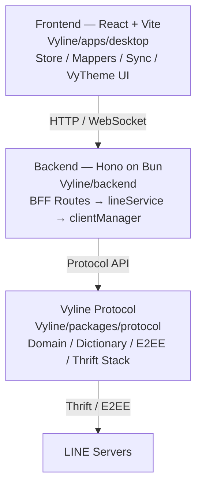

<!--@languages=ja,en-->
<!--@default=ja-->
[English](README.en.md)

<h1 align="center">Vyline <sup>Beta</sup></h1>

<p align="center">
  <strong>Vision Beyond Limits.</strong><br/>
  自前のプロトコルスタックで動作する、拡張可能な LINE サードパーティクライアント
</p>

<p align="center">
  
  
  
  
  
  
</p>

<p align="center">このさんさんとした太陽の下、Vyline を選んでくださるユーザーに出会えたことに感謝します。</p>

<p align="center">
  <a href="#vyline-とは">概要</a> ・
  <a href="#主な機能">機能</a> ・
  <a href="#インストール更新">インストール・更新</a> ・
  <a href="#vyline-を支援する">支援・参加</a> ・
  <a href="#公開-api">API</a> ・
  <a href="#ドキュメント">ドキュメント</a> ・
  <a href="#ロードマップ">ロードマップ</a>
</p>

> [!CAUTION]
> Vyline は **LINE 非公式・未承認**のサードパーティクライアントです。LINE 株式会社および LY Corporation とは関係ありません。利用規約への抵触やアカウント停止を含むリスクを理解したうえで、自己責任で使用してください。

> [!NOTE]
> 2026年8月20日に Beta 0.5.0 として公開を開始しました。現在のバージョンは **Beta 0.8.0** です。Beta 版のため、仕様変更・不具合・データ損失が発生する可能性があります。

---

## Vyline とは

**Vyline** は、メッセージの送受信、Flex / Rich 表示、テーマカスタマイズ、Snapshot などを備えた Web / React ベースの LINE クライアントです。

外部の中継サービスに依存せず、独自実装のプロトコルパッケージ **`@vyline/protocol`** を介して LINE サーバーと通信します。UI、バックエンド、プロトコルを分離しているため、テーマ、公開 API、将来のプラグインやカスタムクライアントへ拡張できる構成です。

| 項目 | 内容 |
| --- | --- |
| 対象 | UI を自分好みに調整したいユーザー、開発者、セルフホスト利用者 |
| 特徴 | 自前プロトコル、VyTheme、公開 API、ローカル優先のデータ管理 |
| 技術 | React + Vite / Hono on Bun / TypeScript / Thrift |
| 状態 | Beta 0.8.0 |
| ライセンス | MIT |

## 主な機能

| カテゴリ | 内容 |
| --- | --- |
| **ログイン** | QR / Email ログイン、マルチアカウント、セッション復元 |
| **メッセージ** | 送受信、返信、送信取り消し、既読制御、再送 |
| **メンション** | `@ALL` / `@名前`、LINE Desktop 準拠の `MENTION` metadata |
| **メディア** | 画像、動画、音声、LINE 絵文字（sticon）、スタンプ。画像の自動圧縮と高画質送信に対応 |
| **Flex / Rich** | 公式形式に準拠した描画、カルーセルのマウスドラッグ |
| **リアクション** | 1クリックリアクション、公式バッジ、既読者一覧 |
| **通話** | 音声 / ビデオ通話（実験的） |
| **チャット管理** | ピン、非表示、ミュート、ブロック、MID コピー、グループ作成・招待 |
| **VyTheme** | テーマ、文字サイズ、表示密度、プロフィール背景のカスタマイズ |
| **E2EE** | Letter Sealing の復号・送信、LINE Desktop の鍵のインポート |
| **プライバシー** | ストリーマーモード、PIN ロック |
| **ベータ機能** | ブロック状態確認（機能ごとの追加同意が必要） |
| **Snapshot** | `vyl snapshot` によるデータの作成・一覧・復元・定期作成 |
| **初回設定・引継ぎ** | 3 ステップの Vyline Setup、MID ごとの設定、設定だけを含む改ざん検知付き ZIP 引継ぎ |
| **診断と安全性** | 個人情報をマスキングした診断ログ、Windows DPAPI によるセッション保護、端末単位のサブデバイス照合 |
| **開発者向け** | Bearer トークン対応の公開 API、OpenAPI 3.1、JSONL 詳細ログ、Tailscale 経由の安全な遠隔利用 |
| **その他** | Keepメモ、プロフィール背景、通話中バッジ、共通グループの高速表示、トークの TXT 保存 |

---

## Vyline を支援する

Vyline は個人開発のオープンソースプロジェクトです。支援は、開発環境、テスト、サーバー、ドキュメントの維持に活用します。

### 支援方法

| 方法 | 内容 |
| --- | --- |
| **PayPay** | PayPay の「送る・受け取る」による支援 |
| **Amazon ギフトカード（アマギフ）** | Amazon ギフトカードによる支援 |
| **その他のギフトカード** | Apple Gift Card、Google Play、Steam など。事前に相談してください |
| **開発・デザイン** | コード、ドキュメント、UI、アイコン、バナーなどでの貢献 |

送付先や手順は、[nezumi0627 のGitHubプロフィール](https://github.com/nezumi0627) に掲載している連絡先から事前にお問い合わせください。支援方法は状況に応じて案内します。

> [!IMPORTANT]
> 支援は任意であり、機能実装、バグ修正、個別サポート、将来の提供を保証するものではありません。ギフトカード番号、PayPayの送付情報、セッション、トークン、暗号鍵を Issue、Pull Request、公開チャットへ投稿しないでください。送信後の返金や取り消しには対応できない場合があります。

### メンテナー

| メンテナー | 役割 |
| --- | --- |
| [nezumi0627](https://github.com/nezumi0627) | リード開発者 |
| [YoseiUshida](https://github.com/youseiushida) | 定期メンテナー |

### Development Partner

- [REINs](https://github.com/areteruhiro/LEINs) — Development Partner

Vyline と REINs は、それぞれ独立したプロジェクトとして開発・運営を続けながら、必要に応じて開発や技術研究で協力します。

### メンテナー・コントリビューター募集

Vyline の継続的な開発を支えるメンテナーとコントリビューターを募集しています。

- **メンテナー**: Issue の整理、PRレビュー、リリース、ドキュメントの保守
- **開発**: バグ修正、API、プロトコル、UI、ストレージ、テスト
- **デザイン**: VyTheme、アプリアイコン、テーマアイコン、バナー
- **ドキュメント**: セットアップ、APIリファレンス、翻訳、トラブルシューティング

参加方法は [コントリビューションガイド](docs/CONTRIBUTING.md) を確認し、まず Issue または Pull Request で提案してください。

---

## ご利用前の重要事項

- **アカウントリスク**: LINE の利用規約に抵触し、アカウント停止などの措置を受ける可能性があります。
- **同意ゲート**: ログイン後に利用規約と免責事項を表示します。同意が完了するまで、同期・通信・メッセージ表示を含むアプリ機能は開始されません。ゲートの回避や改変はサポート対象外です。
- **利用目的**: 教育、学習、研究、個人利用を想定しています。不正アクセス、攻撃、迷惑行為、権利侵害への利用は禁止します。
- **データの保存**: ログイン情報、セッション、暗号鍵、トーク履歴は、ユーザーが管理するローカル環境またはセルフホスト先に保存されます。通常動作に必要な通信を除き、Vyline 開発者が運営する外部サーバーへ送信しません。
- **無保証**: 本ソフトウェアの使用により生じたアカウント停止、データ破損、損失、法的問題などについて、開発者およびコントリビューターは責任を負いません。
- **解析ツール**: `tools/` 以下は [vyline-search](https://github.com/nezumi0627/vyline-search) を Git Submodule として参照します。教育・研究目的でのみ使用し、解析対象や解析結果を不適切に再配布しないでください。詳細は [docs/tools/DISCLAIMER.md](docs/tools/DISCLAIMER.md) を参照してください。
- **ベータ機能**: 「ベータ機能」タブの機能は、全体の利用規約同意とは別に機能単位の説明・同意を表示します。同意ログとベータ機能の処理結果は端末内で扱い、メッセージ本文や確認結果を Vyline の外部サービスへ送信しません。LINE との通常の通信は発生します。これは法的助言ではありません。

---

## インストール・更新

### 方法を選ぶ

| 用途 | 推奨方法 | 説明 |
| --- | --- | --- |
| はじめて試す | `vyl` の対話式セットアップ | 手動で全体を把握する前に、インストール・診断・修復を選べます |
| 開発・動作確認 | Bun + ソースコード | フロントエンドとバックエンドを個別に確認できます |
| 自宅サーバー・複数端末 | Docker Compose | データをボリュームに保存して Web ブラウザから利用できます |
| Windows の単体アプリ | Beta 対応 | GitHub Releases の `VylineSetup-<version>.exe` を使用します |
| Linux の単体アプリ | Beta 対応 | GitHub Releases の `Vyline-linux-x64-<version>.tar.gz` を使用します |

> [!NOTE]
> Windows版・Linux版は GitHub Releases から導入できます。サーバー用途では Docker Compose を使用してください。

### vyl で始める（推奨）

`vyl` は Vyline のインストール、診断、修復、起動、プラグイン作成、Snapshot 作成をまとめる入口です。npm / Bun 公開後は次の形で使う想定です。

```bash
bunx vyl init
bunx vyl install
bunx vyl doctor
```

このリポジトリ内では、公開前でも次のコマンドで同じ流れを確認できます。

```bash
bun install
bun run vyl init
bun run vyl:doctor
bun run vyl:fix
```

`vyl install` は通常の丸ごと clone だけでなく、archive-first の導入と developer shallow clone を選べるようにします。既存のセットアップが壊れた場合は `vyl doctor` で状態を確認し、`vyl fix` で `.env`、`data/`、`storage/`、submodule、依存関係を修復します。

### ソースコードからインストール（Bun）

- [Git](https://git-scm.com/)
- [Bun](https://bun.sh/)

### 開発環境で起動

```bash
git clone --recurse-submodules https://github.com/nezumi0627/Vyline.git
cd Vyline
# 必要に応じて環境変数を設定（macOS / Linux / Git Bash）
cp .env.example .env
bun install
bun run vyl:doctor
bun run dev
```

PowerShell の場合:

```powershell
Copy-Item .env.example .env
```

起動後、ブラウザで `http://localhost:5173` を開きます。バックエンドは `http://localhost:3001` で待ち受けます。

`bun install` はワークスペース全体の依存関係をインストールします。`Vyline/backend` や `Vyline/apps/desktop` で個別に install する必要はありません。

| コマンド | 内容 |
| --- | --- |
| `bun run vyl init` | 対話式セットアップ |
| `bun run vyl:doctor` | 環境診断 |
| `bun run vyl:fix` | よくあるセットアップ不備の修復 |
| `bun run dev` | バックエンドとフロントエンドを同時に起動 |
| `bun run dev:backend` | バックエンドのみ起動（`:3001`） |
| `bun run dev:frontend` | フロントエンドのみ起動（`:5173`） |
| `bun run typecheck` | 全ワークスペースの型チェック |
| `bun run lint` | Biome による lint |
| `bun run build` | フロントエンドの本番ビルド |

導入の詳細は [Vyline/docs/vyl-cli.md](Vyline/docs/vyl-cli.md)、[オンボーディング](docs/onboarding.md) と [開発ガイド](docs/development.md) を参照してください。

### Bun環境の更新

ローカルで変更したファイルがある場合は、先にコミットまたは退避してください。更新前に Snapshot を作成しておくと安全です。

```bash
bun run vyl snapshot create before-update
git status --short
git pull --ff-only
bun install
bun run vyl:doctor
bun run typecheck
bun run dev
```

`git pull --ff-only` が失敗した場合は、ローカル変更を確認してから手動で merge または rebase してください。`git reset --hard` で変更を消す必要はありません。

### Snapshot

従来のバックアップ/リストア導線は **Snapshot** として整理します。Snapshot は `data/` を復元可能なアーカイブとして保存します。

```bash
bun run vyl snapshot create manual
bun run vyl snapshot list
bun run vyl snapshot restore snapshots/vyline-snapshot-xxxx.tar.gz --force
bun run vyl snapshot schedule daily
```

Windows では `snapshot schedule` が `VylineSnapshot` のタスク登録を試みます。その他の環境では cron / systemd timer に貼り付けるためのコマンドを表示します。

### Docker でインストール

```bash
git clone --recurse-submodules https://github.com/nezumi0627/Vyline.git
cd Vyline
docker compose up -d --build
```

起動後は `http://localhost:3000` へアクセスします。Docker版はフロントエンドとバックエンドを同一オリジンで配信します。

### Docker環境の更新

```bash
docker compose pull
docker compose up -d
```

ソースコードからイメージを作り直す場合は、`git pull --ff-only && docker compose up -d --build` を使用します。

`docker compose up -d --build` が既存コンテナを再作成しても、ホスト側の `./data/` ディレクトリは維持されます。**`data/` にはセッションや鍵が含まれるため、削除しないでください。**

トーク履歴、画像、セッションなどは `./data/` へ永続化され、同じ LINE セッションを複数の Web ブラウザから利用できます。

### Linux単体版

```bash
tar -xzf Vyline-linux-x64-<version>.tar.gz
cd Vyline-linux-x64-<version>
./install.sh
~/.local/bin/vyline
```

遠隔アクセスは **Tailscale 推奨**です。PC で Vyline を起動した状態で、スマホにも Tailscale を入れて同じアカウントでログインすれば、`http://100.x.y.z:3000` でアクセスできます。Tailscale 起動時はバックエンドログに URL が自動出力されます。設定の詳細は[セルフホストガイド](docs/selfhosting.md) を参照してください。

### 既定のプロトコルプロファイル

| 項目 | 既定値 | 備考 |
| --- | --- | --- |
| クライアント | `IOSIPAD 26.7.2` | `x-line-application` に使用 |
| プロファイルOS | `iOS 18.0` | プロトコル上の識別値 |
| デバイスモード | `IOSIPAD` | `VYLINE_DEVICE` で変更可能 |

> [!IMPORTANT]
> 上記は LINE サーバーへ送る**プロトコル識別値**であり、Vyline を実行するホストOSの要件ではありません。定義元は `packages/protocol/src/desktop/types.ts` の `DesktopProfile` です。

---

## アーキテクチャ



| パス | 役割 |
| --- | --- |
| `Vyline/apps/desktop` | React + Vite によるフロントエンド |
| `Vyline/backend` | Hono ベースの BFF、認証、同期、API |
| `Vyline/packages/protocol` | ドメインモデル、辞書、E2EE、Thrift 通信 |
| `Vyline/packages/line-types` | vendored の Thrift 型定義 |
| `Vyline/packages/cli` | `vyl` CLI、診断、修復、Snapshot、plugin scaffold |

詳細は [docs/architecture.md](docs/architecture.md) を参照してください。

---

## 公開 API

セルフホストした Vyline は、Bearer トークンを使って外部ツールや独自クライアントから操作できます。API は `/v1/` 配下で提供されます。

| エンドポイント | 用途 |
| --- | --- |
| `/v1/*` | トークン認証された Vyline API |
| `/openapi.json` | OpenAPI 3.1 の機械可読仕様 |
| `/docs` | API ドキュメント UI |
| `/swagger` | Swagger UI |

> [!TIP]
> 利用可能なエンドポイントはバージョンによって異なる場合があります。実行中のサーバーが返す `/openapi.json` を正として扱ってください。

### トークンの作成

環境変数 `VYLINE_API_ADMIN_SECRET` を設定してから、管理シークレットでトークンを作成します。

```bash
curl -X POST http://localhost:3001/v1/tokens \
  -H "Authorization: Bearer $VYLINE_API_ADMIN_SECRET" \
  -H "Content-Type: application/json" \
  -d '{"name":"my-bot"}'
```

### API の利用例

```bash
curl http://localhost:3001/v1/accounts/{accountId}/chats \
  -H "Authorization: Bearer vyl_xxxx..."
```

> [!WARNING]
> `VYLINE_API_ADMIN_SECRET`、発行済みトークン、セッション、暗号鍵をリポジトリやログへ含めないでください。

API の設計と利用方法は [docs/api/openapi.md](docs/api/openapi.md) および [公開ドキュメント](https://zensical.org) を参照してください。

## テーマ・プラグイン・カスタムクライアント

Vyline は API ファーストの拡張可能なクライアントを目指しています。

### VyTheme

テーマ、文字サイズ、表示密度、プロフィール背景を変更できます。今後は CSS 変数、背景、各 UI 要素を対象としたカスタムセレクターを整備し、コードを直接変更せずに外観を調整できる仕組みを強化します。

### プラグインシステム

JavaScript / TypeScript で機能を追加できるプラグインシステムを整備しています。雛形は `vyl` から作成できます。

```bash
bun run vyl plugin create my-plugin
```

- Manifest によるプラグイン情報と互換バージョンの宣言
- API ごとの権限スコープと、インストール時の権限確認
- 補完可能な型定義と安定した Open API
- 起動、停止、更新、無効化を管理するライフサイクル
- 互換性を壊す変更に対するバージョニング方針

### カスタムクライアント

公開 API と OpenAPI 仕様を利用し、Vyline バックエンド上に独自 UI、Bot、連携ツールを構築できる設計を進めています。

---

## E2EE / LINE Desktop の鍵

過去の Letter Sealing メッセージを復号するには、公式 LINE Desktop から抽出した自己鍵一式が必要です。

1. LINE Desktop を起動した状態で鍵を抽出します（[docs/analysis/](docs/analysis/)）。
2. 鍵を `backend/data/desktop-e2ee-keys.json` に配置します。
3. バックエンド起動時に鍵が自動でインポートされます。

> [!CAUTION]
> `desktop-e2ee-keys.json` は機密情報です。必ず `.gitignore` の対象にし、コミット、共有、ログ出力をしないでください。

---

## v0.5.0 の破壊的変更

v0.5.0 は v0.4.x と互換性がありません。アップグレード時に、既存の設定やキャッシュの一部を再作成する必要がある場合があります。

| 変更 | 影響 |
| --- | --- |
| 受信エンジンを Push 長ポールから `fetchOps` 方式へ刷新 | イベントポーリングの挙動が変更されます |
| 公開 API（`/v1/`）を新設 | `VYLINE_API_ADMIN_SECRET` を設定するとトークンを管理できます |
| 通話、メンバー変更、アナウンスなどのイベントを追加 | 旧フロントエンドとは互換性がありません |

```bash
git pull
bun install
bun run dev
```

既存のログイン状態は維持されます。詳細な変更内容は [CHANGELOG.md](CHANGELOG.md) を参照してください。

---

## バージョニング

Vyline はセマンティックバージョン（`X.Y.Z`、Beta 期間中は `X.Y.Z-beta`）を採用します。リリース時は Git タグ `v<version>`（例: `v0.6.0-beta`）を作成します。

バージョンは次の **4 箇所を同一に** 保つ必要があります:

| 場所 | フィールド |
| --- | --- |
| `package.json`（ルート） | `version` |
| `Vyline/apps/desktop/package.json` | `version` |
| `Vyline/apps/desktop/src/lib/store.ts` | `UPDATE_NOTES.version`（+ `title` / `items` はユーザー向け更新内容） |
| `README.md` | バッジの `version-...` |

手動更新の手間を避けるため、bump スクリプトで一括更新できます:

```bash
bun run bump -- 0.7.0
bun run bump -- patch
```

スクリプトは上記のバージョン箇所と README バッジを自動で書き換えます。`UPDATE_NOTES.items` と CHANGELOG エントリはリリースごとに手動（または AI エージェント）で追記します。詳細は [AGENTS.md](AGENTS.md) の「バージョン管理」を参照してください。

---

## 解析ツールキット

[vyline-search](https://github.com/nezumi0627/vyline-search) は、Desktop LINE の unpack、ネイティブシンボル検索、逆コンパイルを行う独立ツールキットです。文字列 xref を利用した `findNativeSymbol` と Ghidra decompile をワンコマンドで実行できます。

> [!WARNING]
> unpack やアップデートを実行する前に LINE Desktop を完全に終了してください。起動中は単一インスタンス制御によって Frida の注入が拒否され、`ProcessNotRespondingError` になる場合があります。

```powershell
bun run vyline:check                       # インストール版と最新版を比較
bun run vyline:versions                    # インストール済みバージョンを一覧表示
bun run vyline:unpack -- --version <ver>   # 指定バージョンを unpack
bun run vyline:update                      # LINE Desktop を更新
bun run vyline:find-native -- sendMessage  # ネイティブシンボルを検索
```

解析ツールは教育・研究目的でのみ使用してください。詳細な免責事項は [docs/tools/DISCLAIMER.md](docs/tools/DISCLAIMER.md) を参照してください。

---

## ドキュメント

| ドキュメント | 内容 |
| --- | --- |
| [docs/README.md](docs/README.md) | ドキュメント索引 |
| [Vyline/docs/vyl-cli.md](Vyline/docs/vyl-cli.md) | `vyl` CLI、対話式セットアップ、診断、修復、Snapshot |
| [docs/onboarding.md](docs/onboarding.md) | 初回セットアップ |
| [docs/development.md](docs/development.md) | 開発環境とコマンド |
| [docs/architecture.md](docs/architecture.md) | アーキテクチャ |
| [docs/selfhosting.md](docs/selfhosting.md) | Docker と Cloudflare Access |
| [docs/protocol/dictionary.md](docs/protocol/dictionary.md) | RPC 辞書 |
| [docs/api/openapi.md](docs/api/openapi.md) | OpenAPI と公開 API |
| [docs/developers/index.md](docs/developers/index.md) | **開発者向けガイド（読む順序つき）** |
| [docs/developers/plugin-system.md](docs/developers/plugin-system.md) | プラグイン開発（サンプル付き） |
| [docs/developers/for-ai.md](docs/developers/for-ai.md) | AI エージェント向け指示書 |
| [examples/](examples/) | プラグイン・API サンプルコード |
| [docs/user-guide/update.md](docs/user-guide/update.md) | アップデート方法 |
| [docs/user-guide/custom-client.md](docs/user-guide/custom-client.md) | カスタムクライアントの作り方 |
| [docs/user-guide/themes.md](docs/user-guide/themes.md) | テーマの作り方（VyTheme） |
| [docs/CONTRIBUTING.md](docs/CONTRIBUTING.md) | コントリビューションガイド |
| [AGENTS.md](AGENTS.md) | コーディングエージェント向けガイド |
| [CHANGELOG.md](CHANGELOG.md) | 変更履歴 |

公開ドキュメントと API リファレンス: **[zensical.org](https://zensical.org)**

---

## ロードマップ

- **API / Swagger**: `/v1/`、`/openapi.json`、`/docs`、`/swagger` の整備と安定化
- **vyl CLI**: インストール、診断、修復、Snapshot、プラグイン雛形の導線改善
- **プラグインシステム**: JavaScript / TypeScript、権限スコープ、型付き Open API
- **カスタムクライアント**: 独自フロントエンド、Bot、外部ツールとの連携
- **マルチアカウント**: アカウント単位の認証・データ・メディア分離
- **ストレージ管理**: キャッシュと保存済みメディアの分離、容量表示、Snapshot 作成・復元
- **複数画像送信**: 個別の IMAGE メッセージとグルーピング表示
- **サーバーモード**: Docker Compose とセルフホスト運用の改善
- **軽量化**: メモリ、CPU、通信量を計測し、公式クライアント以下を目標に改善

### Vyline Desktop — Coming Soon

安定版の公開後、専用デスクトップアプリ **Vyline Desktop** をリリース予定です。

- Windows / macOS / Linux 対応
- ネイティブ通知とクイック返信
- トレイアイコン常駐
- ローカルデータの完全管理

---

## コントリビューション

バグ修正、機能改善、ドキュメント、デザインへの貢献を歓迎します。

- [バグを報告する](.github/ISSUE_TEMPLATE/bug_report.md)
- [機能を提案する](.github/ISSUE_TEMPLATE/feature_request.md)
- [Pull Request を作成する](.github/pull_request_template.md)

参加前に [コントリビューションガイド](docs/CONTRIBUTING.md) を確認してください。Pull Request に解析対象ソフトウェア、セッション、鍵、トークンなどの機密情報を含めないでください。

### エージェント / Skill 方針

開発では必要に応じて Ponytail、Caveman、agent-skills-standard、addyosmani agent-skills、Minimize-Cursor-Cost などの coding-agent 用 Skill を利用します。不要なコードと過剰設計を避け、レビュー品質を保つことが目的です。

優先順位は次のとおりです。

1. セキュリティ
2. プライバシー
3. データ保護
4. 既存機能との互換性
5. 実装量・トークン・コストの削減

効率化よりも正確性と安全性を優先します。詳細は [AGENTS.md](AGENTS.md) を参照してください。

---

## References

以下のプロジェクトは、Vyline の調査・研究・実装において技術的な参考資料として参照したものです。

特記がない限り、これらのプロジェクトおよび開発者と Vyline の間に、公式な提携・所属・承認・その他の深い関係はありません。

- [CHRLINE (old)](https://github.com/DeachSword/CHRLINE)
- [CHRLINE-Thrift](https://github.com/DeachSword/CHRLINE-Thrift/)
- [CHRLINE-Patch](https://github.com/WEDeach/CHRLINE-Patch)
- [linejs](https://github.com/evex-dev/linejs)
- [line-py](https://github.com/fadhiilrachman/line-py)

---

## ライセンスと著作権

Vyline は [MIT License](LICENSE) のもとで公開されています。

Copyright © [nezumi0627](https://github.com/nezumi0627)

改変や再配布を行う場合は、`LICENSE` に記載された著作権表示とライセンス表示を保持してください。

---

<p align="center">
  <strong>Vision Beyond Limits.</strong><br/>
  Built with care by <a href="https://github.com/nezumi0627">nezumi0627</a> and contributors.
</p>
